# DrinkDecider 🍹
DrinkDecider is a mobile application that helps you discover and create amazing drinks based on your preferences and available ingredients. Whether you're hosting a party, experimenting with mixology, or just looking for something new, DrinkDecider has you covered!
# Features 📱
<b>1. Main Menu</b> 
The app starts with a user-friendly Main Menu that allows you to navigate to the following sections:
<ul>
  <li>
    <b>Start (Bartender's Interview):</b> Answer a series of questions to receive 5 personalized drink recommendations based on your taste and preferences.
  </li>
  <li>
    <b>Random Drink:</b> Get a surprise drink recommendation with just one tap.
  </li>
  <li>
    <b>Drinks list:</b> Browse a comprehensive list of drinks with a search function to find specific recipes.
  </li>
  <li>
    <b>Drinks Made With My Ingredients:</b> Input the ingredients you have at home, and we'll generate a list of drinks you can make.
  </li>
  <li>
    <b>Language Toggle:</b> Switch between English and Polish at any time.
  </li>
   
  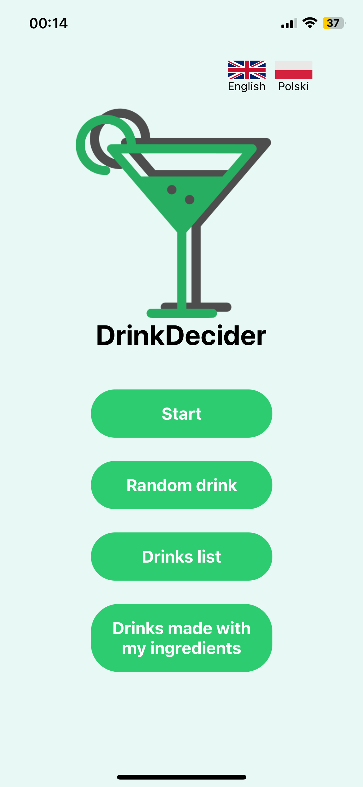
</ul>
 
<b>2. Start (Bartender's Interview)</b> 
The Bartender's Interview guides you through a series of questions to tailor drink recommendations to your preferences:
<ul>
  <li>
    <b>Choose Your Flavor:</b> Select the primary taste you prefer (e.g., sweet, sour, bitter).
      
    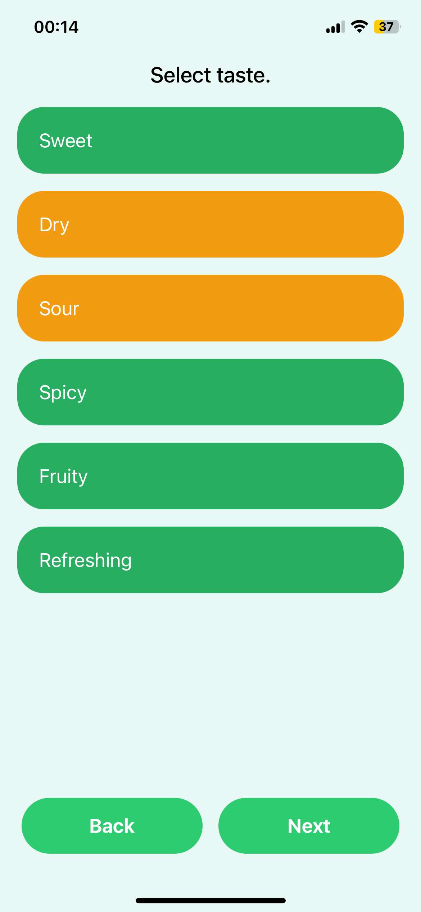
  </li>
  <li>
    <b>Drink Strength:</b> Indicate how strong you want your drink to be.  
    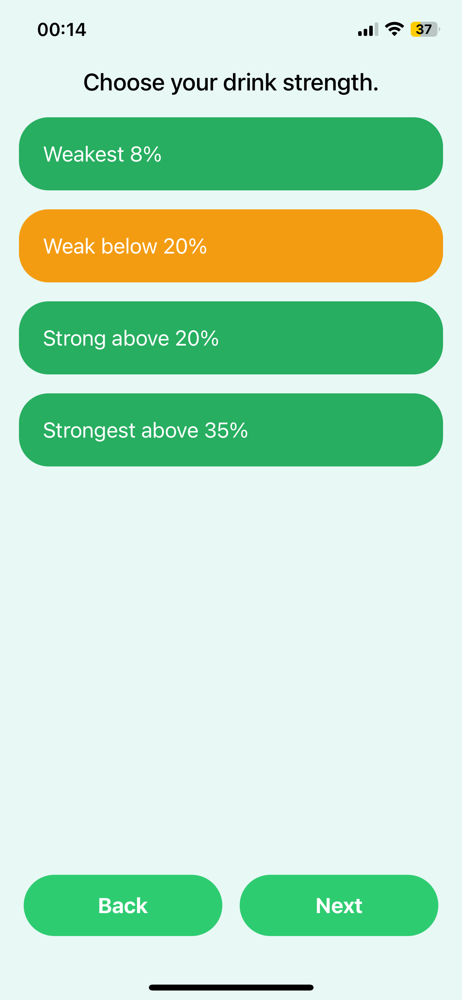
  </li>
  <li>
    <b>Preferred Alcohols (Optional):</b> Specify your favorite types of alcohol, such as vodka, rum, or whiskey.  
    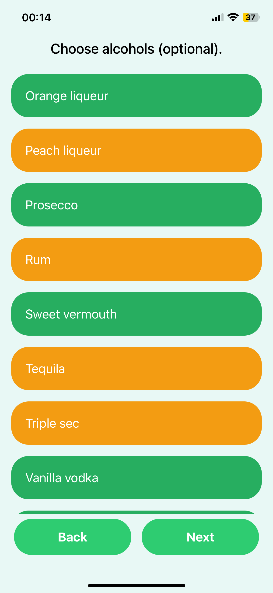
  </li>
  <li>
    <b>Unwanted Ingredients (Optional):</b> List any ingredients you want to exclude (e.g., due to allergies or personal preferences).  
    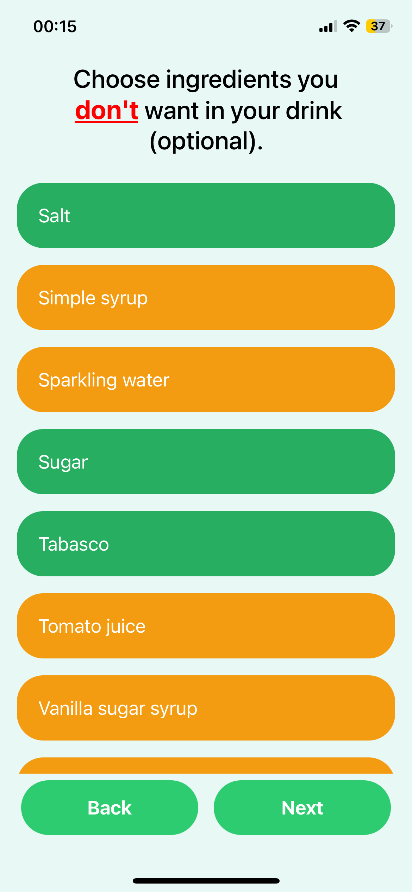
  </li>
  <li>
    <b>Recommendations:</b> Get 5 curated drink options. Each drink includes: Name, ingedients, alcohol types used, description, strength, flavor, a button to view the recipe popup.  
    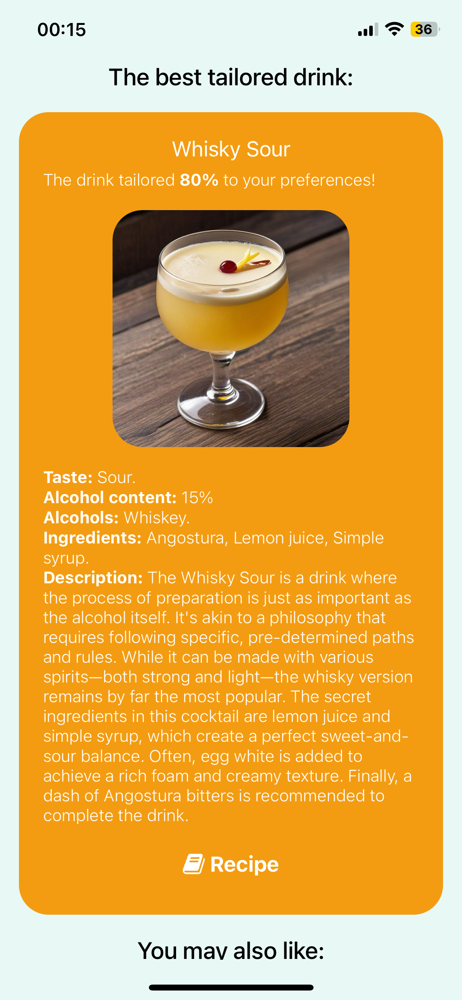
    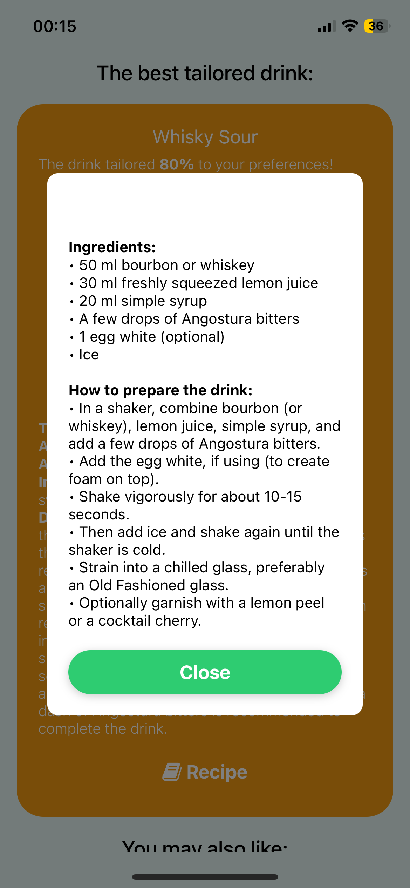
    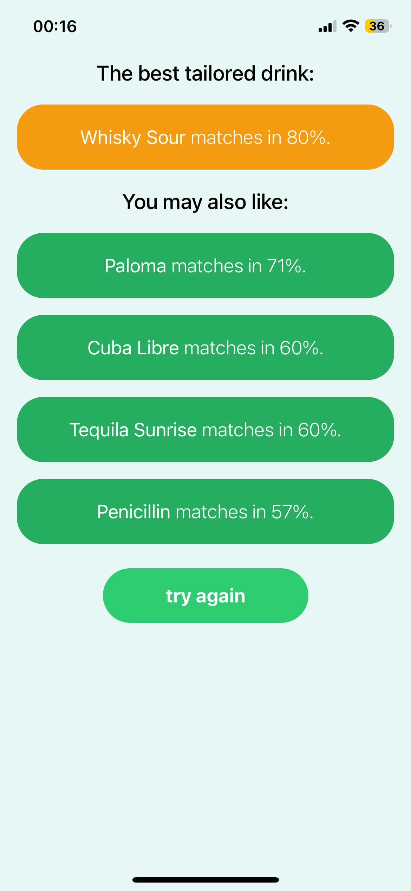
    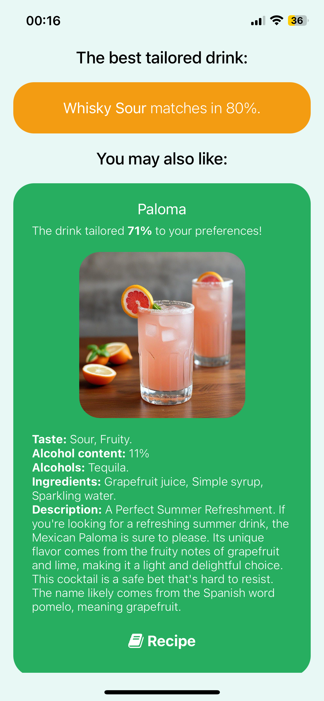
  </li>
</ul>
<b>3. Random Drink</b> 
Feeling adventurous? Use the Random Drink button to get a surprise drink recommendation. Each drink includes:  
<ul>
  
</ul>
<b>4. All Drinks</b> 
Browse the All Drinks section to explore a full list of available drinks. You can search for drinks by name to quickly find your favorites.  
<ul>
  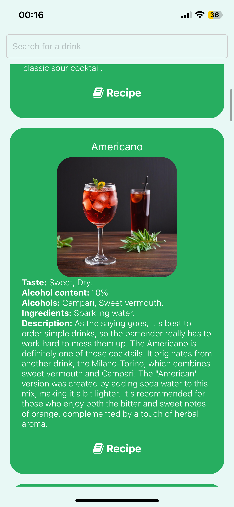
</ul>
<b>5. Drinks Made With My Ingredients</b> 
Use the Drinks Made With My Ingredients section to create drinks from what you already have at home:  
<ul>
  <li>
    <b>Informations</b>
      
    
  </li>
  <li>
    <b>Select the alcohols you have.</b>
      
    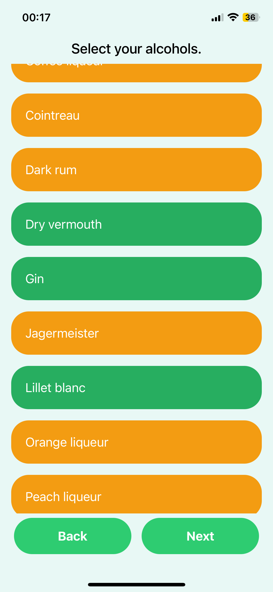
  </li>
  <li>
    <b>Choose the other ingredients you want to use.</b>
      
    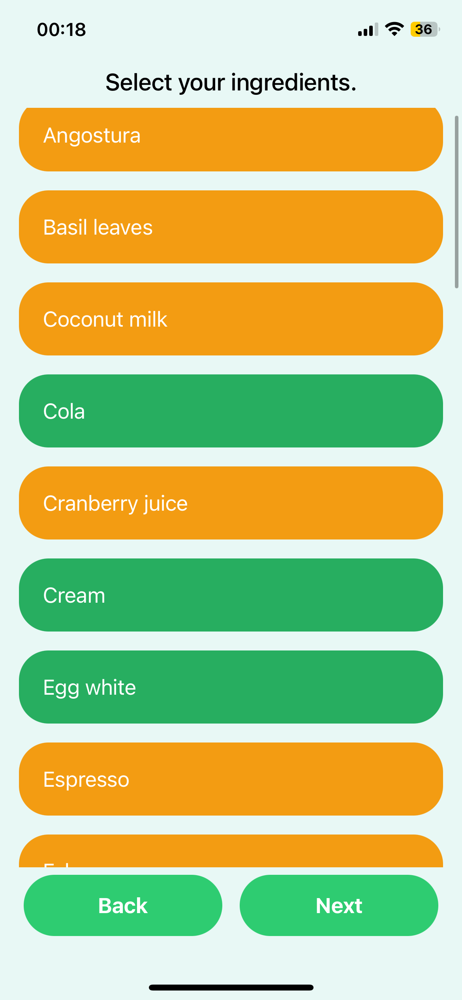
  </li>
  <li>
    <b>Get a list of drinks you can make with the selected items.</b>
      
    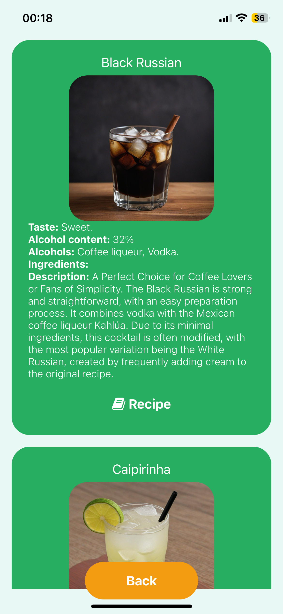
  </li>
</ul>

# Technologies Used 🛠️
<ul>
  <li>
    <b>Frontend:</b> React Native
  </li>
  <li>
    <b>Backend::</b> None (data processing handled locally)
  </li>
  <li>
    <b>Data Storage:</b> JSON files
  </li>
  <li>
    <b>Language Support:</b> English and Polish
  </li>
</ul>

